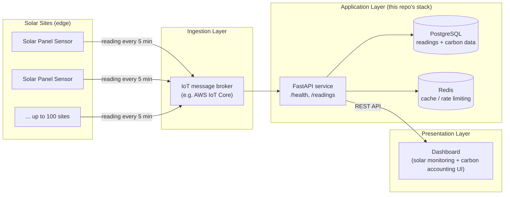

# W1-05 — Cloud Architecture Diagram (Sensor → Cloud → Dashboard)

**Task:** Design cloud architecture diagram (sensor → cloud → dashboard)
**Status:** Done
**Context:** Chrysoptera DevOps internship, Week 1

---

## Diagram

## Layer-by-layer explanation

**1. Field layer — sensors**
Each solar site sends a reading roughly every 5 minutes (the same assumption used in the W1-01 cost comparison). At 100 sites this is a low, steady volume of small messages — the reason the cost comparison favored a lightweight managed IoT ingestion service over something heavier.

**2. Ingestion layer — message broker**
A managed IoT broker (AWS IoT Core in the current cost comparison) receives sensor messages and hands them off to the application layer. This decouples flaky/intermittent field connectivity from the API — sensors don't need to know anything about the backend.

**3. Application layer — this repo's actual stack**
This is the part already built and running locally in `chrysoptera-stack/`:
- **FastAPI** exposes `/health` and `/readings`, matching what's already implemented.
- **PostgreSQL** persists readings and (eventually) carbon-accounting calculations.
- **Redis** is available for caching or rate-limiting once traffic grows.

**4. Presentation layer — dashboard**
Consumes the FastAPI REST endpoints to show live solar monitoring and carbon accounting data. Not built as part of this internship track (outside DevOps scope), but shown for completeness since it's the reason the pipeline exists.

## Notes
- This diagram intentionally mirrors the local `docker-compose.yml` stack from W1-03 — the goal was to show how the thing already running on one machine would map onto a real multi-site cloud deployment, not to design something disconnected from the actual code.
- GitHub renders Mermaid diagrams natively in Markdown, so this file will display the diagram directly in the repo without any extra tooling.
- Kubernetes (from W1-04) would sit *inside* the Application Layer box in a production version of this diagram — one Deployment for the API, one for supporting services, fronted by a Service/Ingress.

---
*Chrysoptera — Cloud Computing / DevOps Internship — Week 1*
